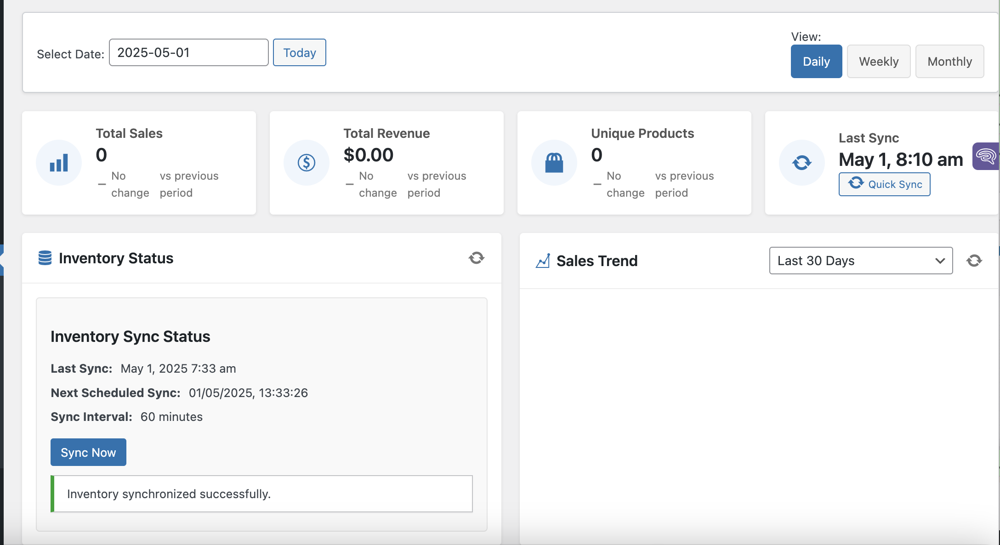
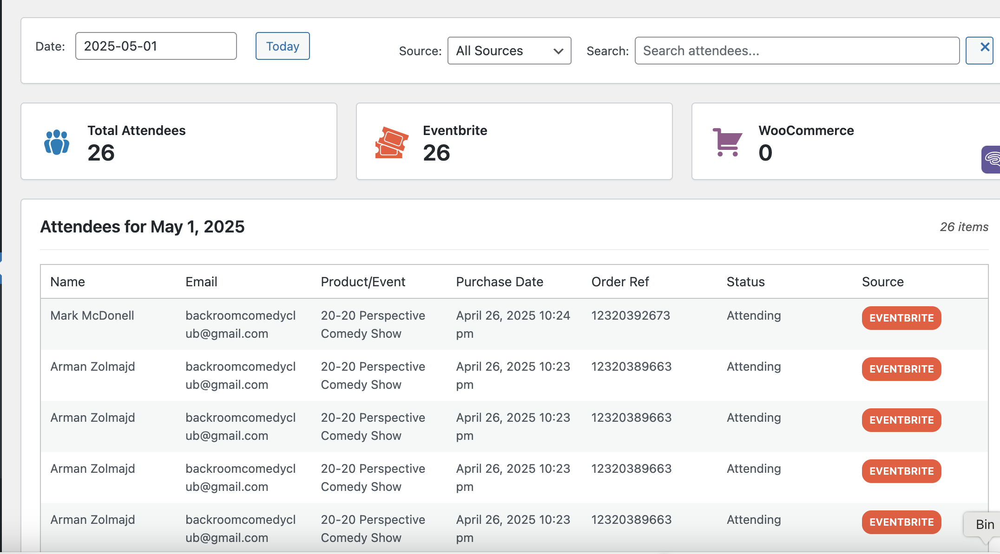
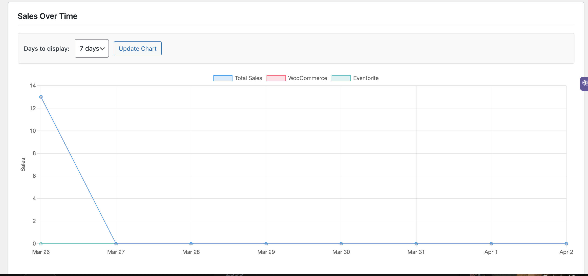
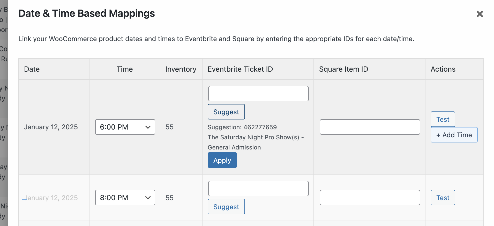
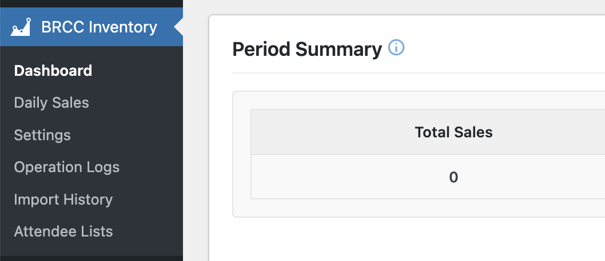
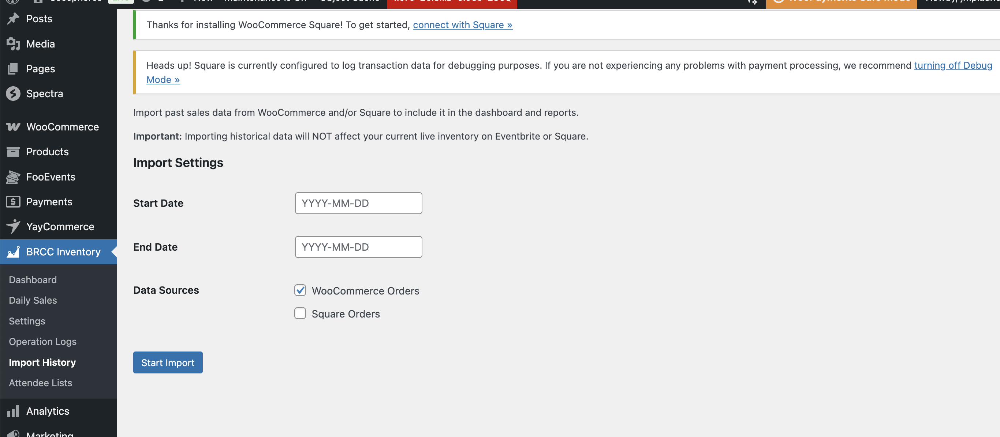

# BRCC Inventory Tracker WordPress Plugin

**Author:** Benjamin
**Tags:** woocommerce, inventory, square, eventbrite, ecommerce, sync, tickets, sales, reporting, mapping, automation
**Requires at least:** 5.0
**Tested up to:** 6.4
**Requires PHP:** 7.4
**Stable tag:** 1.1.0
**License:** GPLv2 or later
**License URI:** http://www.gnu.org/licenses/gpl-2.0.html

Synchronize inventory and view consolidated sales data across WooCommerce, Square, and Eventbrite platforms, with advanced date/time mapping and reporting features.

## Description

BRCC Inventory Tracker provides robust, seamless integration between your WooCommerce store and external sales platforms like Square and Eventbrite. It ensures accurate inventory levels by tracking sales from all connected sources and updating stock accordingly.

This plugin goes beyond basic synchronization, offering:

*   **Advanced Mapping:** Link WooCommerce products to specific Square items and Eventbrite ticket classes.
*   **Date & Time Specificity:** Map inventory for events or products sold on specific dates and times, crucial for managing scheduled events or time-slotted services.
*   **Intelligent Suggestions:** Quickly find and apply the correct Eventbrite Ticket Class ID using the built-in suggestion feature, available for both base products and specific date/time mappings.
*   **Consolidated Reporting:** View combined attendee lists from WooCommerce and Eventbrite for upcoming events.
*   **Automated Notifications:** Receive daily email summaries of attendees for the next day's events via WP-Cron.
*   **Developer Friendly:** Includes a REST API for external inventory management and detailed operation logs for debugging.

Keep your inventory accurate and gain valuable insights into your sales across multiple platforms.

## Features

*   **Multi-Platform Sync:** Synchronizes inventory changes originating from WooCommerce, Square (via webhooks/polling), and Eventbrite.
*   **Product Mapping:** Easily map WooCommerce products to their corresponding Square Catalog Items and Eventbrite Ticket Classes (including Event ID storage).
*   **Date & Time Based Mappings:** Define specific Eventbrite and Square mappings for individual dates and times associated with a WooCommerce product.
*   **Eventbrite ID Suggestion:** Intelligently suggests Eventbrite Ticket Class IDs based on product name, date, and time for faster mapping. Works on both the main product mapping table and the date/time mapping modal.
*   **Consolidated Attendee List:** View a combined list of attendees/purchasers from WooCommerce and Eventbrite on a dedicated admin page, filterable by product.
*   **Daily Attendee Email Report:** Automatically sends a daily email report listing attendees for the next day's events to specified email addresses.
*   **Daily Sales Tracking:** Monitor sales aggregated from all connected platforms on a dedicated Daily Sales page.
*   **Operation Logging:** Detailed logs track synchronization actions, API calls, errors, and manual operations for troubleshooting.
*   **REST API:** Provides endpoints for external systems to query and update inventory levels.
*   **Test Mode:** Safely test configuration and operations without affecting live inventory.
*   **Connection Testing:** Verify API connectivity to Eventbrite and Square directly from the settings page.

## Installation

1.  Upload the `brcc-inventory-tracker` folder to the `/wp-content/plugins/` directory.
2.  Activate the plugin through the 'Plugins' menu in WordPress.
3.  Go to 'BRCC Inventory' > 'Settings' in your admin menu to configure API keys and mappings.

## Frequently Asked Questions

### Does this plugin require WooCommerce?

Yes, the BRCC Inventory Tracker requires WooCommerce to be installed and activated.

### How does the inventory sync work?

The plugin listens for sales events (like completed orders in WooCommerce or webhooks from Square) and updates inventory accordingly. It also includes scheduled tasks (WP-Cron) to periodically pull data from platforms like Square to catch any missed events.

### Can I manually trigger a sync?

Yes, you can manually trigger an inventory sync from the plugin's dashboard page by clicking the "Sync Now" button.

### Where does the Attendee List data come from?

The Attendee List page combines customer data from completed WooCommerce orders for the selected product and attendee data fetched directly from the mapped Eventbrite event via their API.

### How do I configure the daily email?

The email addresses (`webadmin@jmplaunch.com`, `backroomcomedyclub@gmail.com`) and the timing (daily, for next day's events) are currently hardcoded in the plugin. Future versions may include settings for customization. Ensure your WordPress site can send emails reliably.

## Screenshots

1.  **Settings Page:** Configuring API keys for Eventbrite, Square, and general plugin settings.
    
2.  **Product Mapping Interface:** Main table for mapping WooCommerce products to Eventbrite Ticket Class IDs and Square Catalog IDs.
    
3.  **Date & Time Mapping Modal:** Interface for setting specific Eventbrite/Square mappings for individual dates/times, including the "Suggest" feature.
    
4.  **Attendee List Page:** Displaying the combined list of attendees from WooCommerce and Eventbrite for a selected product.
    
5.  **Daily Sales Report:** View aggregated sales data from connected platforms.
    
6.  **Operation Logs:** Detailed logging for tracking plugin actions and debugging.
    

## Changelog

### 1.1.0
*   Feature: Added "Attendee Lists" admin page to view combined WooCommerce & Eventbrite attendees.
*   Feature: Implemented daily email report for next day's attendees via WP-Cron.
*   Feature: Added Eventbrite ID suggestion feature to Date & Time Mapping modal.
*   Enhancement: Store Eventbrite Event ID along with Ticket Class ID during mapping.
*   Fix: Resolved various PHP parse errors and warnings.
*   Update: Improved readme documentation and added new screenshots.

### 1.0.0
*   Initial release.

## Upgrade Notice

### 1.1.0
This version introduces the Attendee List page and daily email reports. Ensure Eventbrite API credentials are correct and include the Eventbrite Organization ID in settings for full functionality. Mapping suggestions are now available in the date/time modal.
